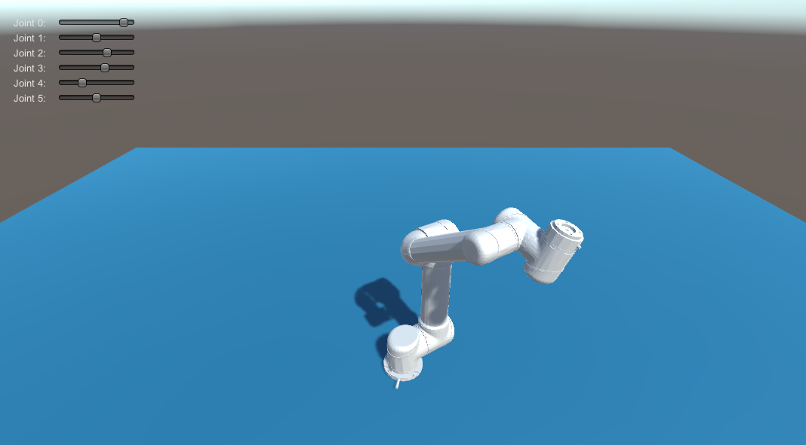
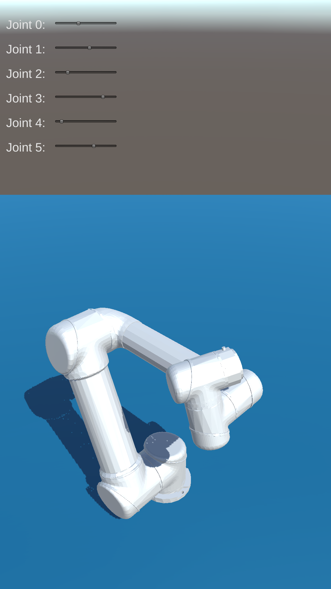

UR5 for Augmented Reality
===
Author: [Long Qian](https://longqian.me/aboutme), [Shuyang Chen](https://www.linkedin.com/in/shuyang-shawn-chen-346ab6109)

Date: 2016-10-16

## Overview
At current stage, a UR5 robot is place in the Unity3D scene, and the robot status is configurable via sliders on GUI layer, like [RViz](http://wiki.ros.org/rviz).

Results on Editor:

Results on Android:

## TODO
* Fix joint upper and lower limits.

